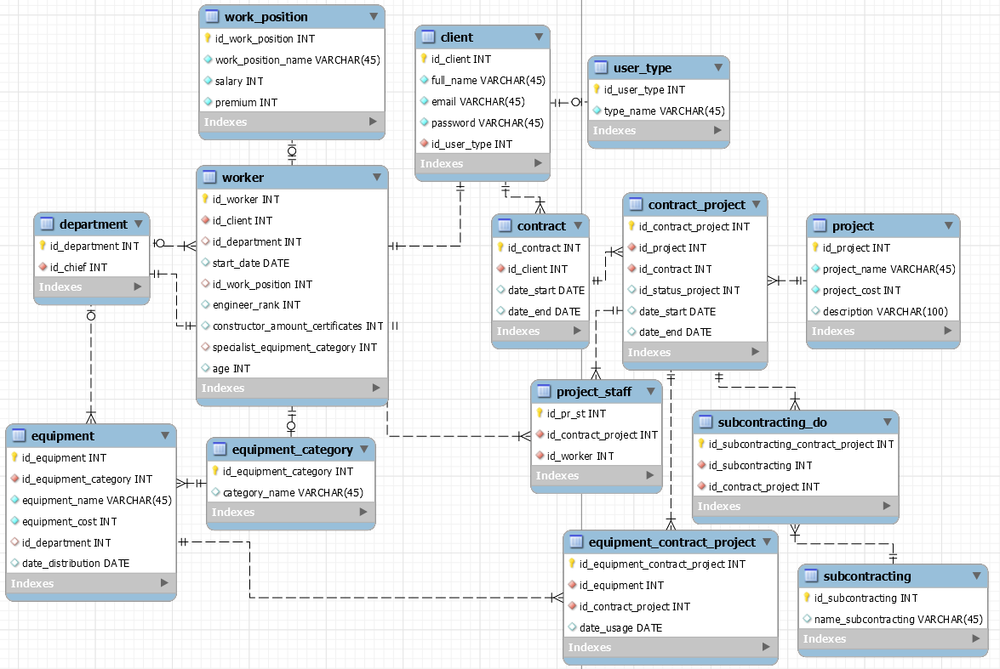
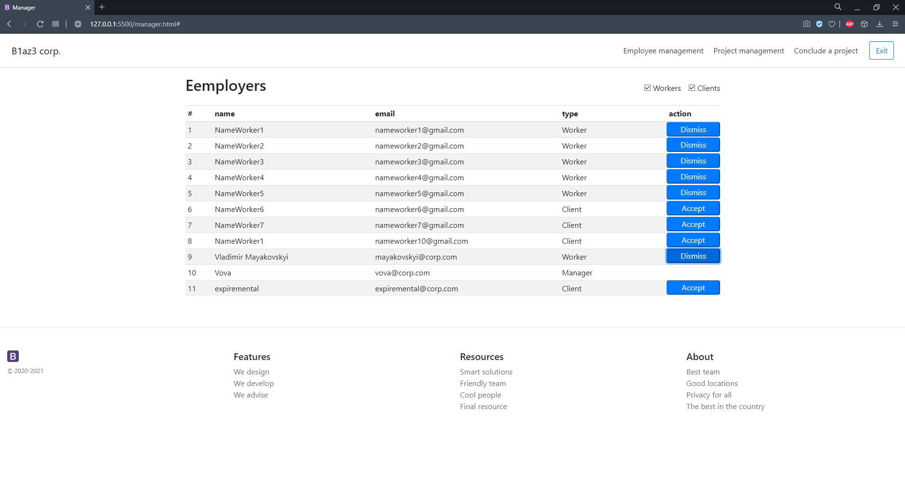

# Coursework KPI 2021 May (frontend + backend) 

My very first large-scale work, which contains both the front-end part and the back-end. 

Based on the task, a website with a database was made. Where the client can find a worker for some construction purpose. An architect can find a job for himself and join the project he wants. And the managers run the whole thing. 

I must say, not perfect work, but i tried:D Then I was very inexperienced. 

This coursework was completed in May 2021.

# The following technologies were used in this work
### [Frontend](https://github.com/B1az333/coursework/tree/main/courseworkSite):
 - HTML
 - CSS
 - Bootstrap
 - Javascript

### [Backend](https://github.com/B1az333/coursework/tree/main/main):
 - Java (Spring boot)
 - mySQL

# Result
I bring to your attention, a small set of screenshots with the result.

If you want to get acquainted with the program in more detail, you can find [documentation](https://github.com/B1az333/coursework/blob/main/Documentation.pdf) in Ukrainian in the root of the project

### Main page

### Authorization

### Registration

### Database

### Client conclude project

### Worker control projects

### Manager managment projects

### Manager managment workers

